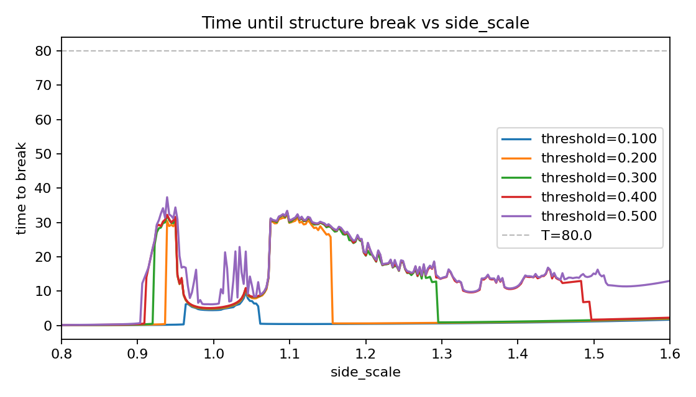

# 4 体 Lennard-Jones 系における構造安定性の初期値依存性

## 背景と位置づけ

- 先行研究では、2 次元で一直線状に配置した 3 体の Lennard-Jones 粒子系に対し、適切な振動励起を加えると長時間にわたって直線配置が保持されることが知られている。
- 本研究では、この安定化メカニズムが 3 次元 4 体系（正三角形状の 3 粒子＋中心粒子）にも拡張できるかを検証することを目的とする。
- 特に、初期構造（正三角形＋中心）が崩壊するまでの時間と、初期三角形の大きさを規定する `side_scale` との関係を調べた。

## シミュレーション設定

- **力学モデル**: 4 粒子すべてが Lennard-Jones ポテンシャルで相互作用。質量は等しく設定。
- **初期配置**: 3 粒子を $z = 0$ の正三角形配置、重心が原点。中心粒子を $z = z_0$ だけずらした位置に配置。
  - ここで、 `side_scale` は三角形の中心から各頂点までの距離をスケールするパラメータ。
  - `side_scale = 1.0` は LJ ポテンシャルの最小値位置に対応。
- **初期速度**: 三角形粒子に対し、頂点から外向きに同じ大きさの呼吸モード速度 `vb` を与え、系全体の運動量をゼロに調整。中心粒子は静止。
- **時間積分**: 4 次のシンプレクティック数値積分法。時間刻み `dt = 0.002`。
- **パラメータ掃引**:
  - `side_scale` を 0.8〜1.6 の範囲で 295 点（等間隔）サンプリング。
  - 各 `side_scale` について同一軌道を再生し、相対距離変化の閾値 $\delta$ を 0.1, 0.2, 0.3, 0.4, 0.5 に設定して崩壊時刻を評価。
  - 崩壊時刻は、初期距離 $d_{ij}(0)$ に対し $|d_{ij}(t) - d_{ij}(0)| / d_{ij}(0) > \delta$ を満たす最初の時刻と定義。
  - $v_b = 0, z_0 = 0.02$
- **観測時間**: $T = 80$ まで追跡し、崩壊が起きなければ $t = T$ として打ち切り。

## 結果サマリ

- 全計算結果（崩壊時刻、最大相対距離変化、閾値ごとの判定）は `reports/side_scale_break.csv` に記録している。
- 主要な可視化を下図に示す（`reports/side_scale_break.png`）。各色が異なる相対距離閾値を表す。

### 主な観察事項

- `side_scale \approx 0.92–0.95` 付近と `side_scale \approx 1.08–1.18` 付近で、閾値 0.3 以上の場合に崩壊時刻が $t \approx 20–35$ まで延びる安定な「棚」が確認できた。
- より厳しい閾値 ($\delta \le 0.2$) では、上記領域でも崩壊時刻が秒単位に低下し、微小変形ですぐに構造が崩れることが分かる。
- `side_scale` を 1.3 以上に拡大すると、閾値 0.3 のケースでも崩壊時刻が約 1–5 に急低下し、中心粒子が三角平面外へ逃げやすくなる。緩い閾値 0.5 でも最長 15 程度に留まる。
- `side_scale < 0.9` では全閾値で崩壊時刻が $1$ 未満となり、三角形が即座に崩壊する。

## 考察と今後の課題

- 2 次元 3 体系のような顕著な長期安定化は見られなかったが、`side_scale` を適切に調整し、許容変形を緩めることで一定時間は構造維持できる可能性がある。
- 呼吸モード速度 `vb`, 初期オフセット `z0`, 微小ノイズなどの影響を系統的に調べることで、安定領域の幅や寿命がどこまで改善できるかを確認したい。
- 閾値を時間依存の評価指標（例: 中心粒子の $z$ 座標 RMS）に置き換え、構造保持の定義を多面的に検討する必要がある。
