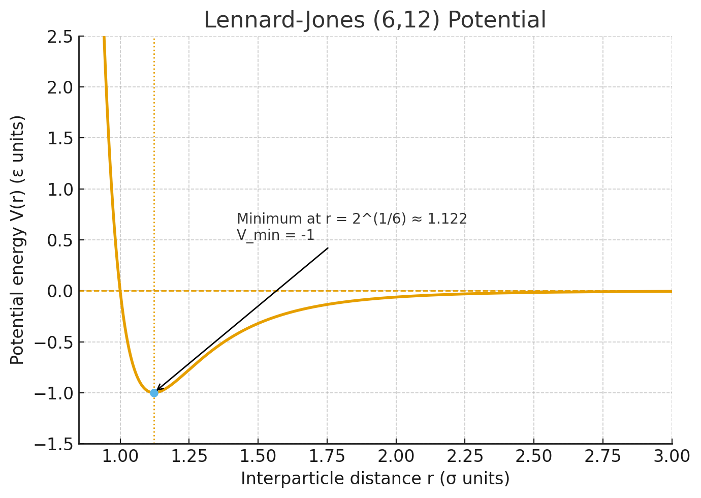
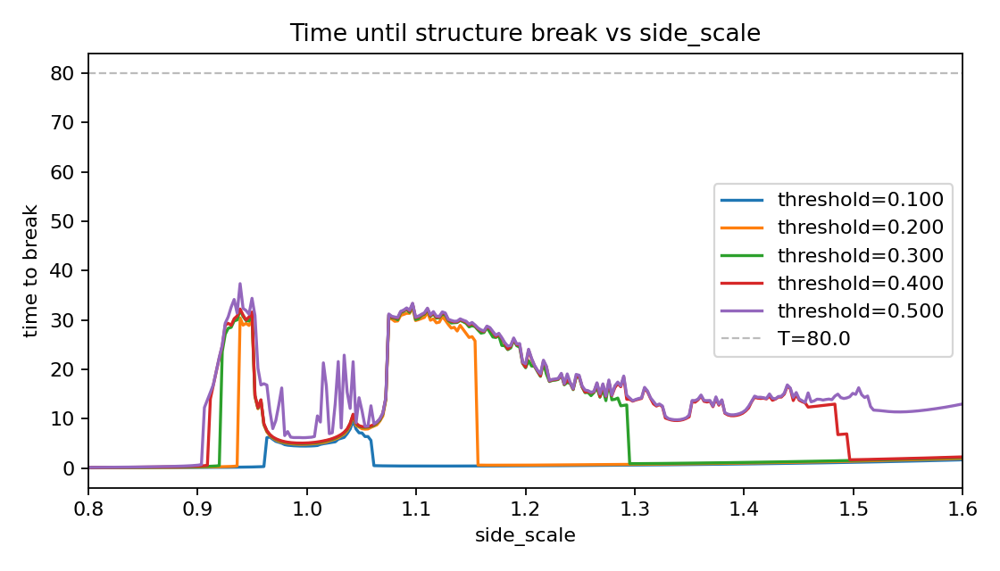

<style>
  .two-column {
    display: flex;
    gap: 24px;
    align-items: center;
  }
  .two-column > div {
    flex: 1;
  }
</style>

<!-- _class: lead -->

# 3 次元 4 体 Lennard-Jones 系の遷移状態における形状の安定性

コロキウム / 2025-10-09
発表者: 金地亮弥

---

## Lennard-Jones ポテンシャルについて

<div class="two-column">
<div>

- (6, 12)型 Lennard-Jones(LJ) ポテンシャル: $V(d) = 4[(1/d)^{12} - (1/d)^6]$
- 原子間の引力・斥力をモデル化
- 最小値は $d = 2^{1/6} \approx 1.122$

</div>
<div>



</div>
</div>

---

## 背景: Lennard-Jones 系と安定化

- 2 次元 3 体の直線配置は、ポテンシャルの鞍点 (遷移状態)となるため不安定
- つまり、より安定な三角形配置に向かうと考えられる
- しかし、基準振動励起により配置が長時間維持できると報告 [1]
- 3 次元 4 体 系にも類似の安定化メカニズムがあるのかを検証

<div class="two-column">
<div>
<video src="lj3_2d_unstable.mov" width="520" controls></video>
</div>
<div>
<video src="lj3_2d_stable.mov" width="520" controls></video>
</div>

</div>

[1] Y. Y. Yamaguchi, _Phys. Rev. E_ **111**, 024204 (2025).

---

## 復習: 直線 3 体系の線形解析

| モード種別  | $\lambda$     | 特徴                           |
| :---------- | :------------ | :----------------------------- |
| 不安定      | $-0.22$       | 面外へ曲がるモードで指数的発散 |
| 安定 (2 本) | $58.2, 176.1$ | 伸縮・呼吸の実振動モード       |
| ゼロ (3 本) | $\approx 0$   | 並進・回転対称性               |

- 先行研究 [1] は安定モードへの励起で直線維持を実現
- 4 体系における不安定方向が何かを特定することが第一歩

---

## 4 体系の幾何と平衡半径

- 正三角形の頂点に 3 粒子、中心に 1 粒子を配置した平衡点を考える
- 正三角形の外周粒子間距離: $s = \sqrt{3}\,r$
- 全ポテンシャル: $U(r) = 3V(r) + 3V(\sqrt{3}\,r)$
- 平衡条件 $U'(r) = 0$ から
  $$
  r^{*6} = \frac{2 \left(1 + 1/3^{6}\right)}{1 + 1/3^{3}} = \frac{365}{189}, \quad r^* \approx 1.116
  $$
- 2 体最適距離よりわずかに短く、中心との引力が平衡距離を縮める

---

## 4 体系のモード解析

| モード種別 | $\lambda$   | 物理像                             |
| :--------- | :---------- | :--------------------------------- |
| 不安定 (1) | $-1.42$     | 中心と周辺が逆符号で面外傘状に変形 |
| 不安定 (2) | $-1.39$     | 正三角形が面内でひし形へ崩壊       |
| 安定 (1)   | $62.1$      | 面内同相の呼吸モード               |
| 安定 (2)   | $160.7$     | 中心が面内で振れ、外周が追随       |
| ゼロ (6)   | $\approx 0$ | 並進 3、回転 3                     |

- 平衡点は 3 本の不安定方向を持つ **鞍点**
- 面外変形の曲率が最も負で、中心粒子が抜けやすい
- まずは、面内呼吸モードを励起して形状安定性を調べる

---

## シミュレーション設定

- 運動方程式: 等質量 4 粒子、LJ ポテンシャルの相互作用が各粒子に働く、束縛条件なし
- 初期配置: 周辺 3 粒子を半径 $r$ の正三角形 (中心原点)、中心粒子を $z_0 = 0.02$ にシフト
- 初期速度: 0
- 数値積分: 4 次シンプレクティック法、時間刻み $\Delta t = 0.002$, 追跡時間 $T = 80$
- 構造崩壊判定: 相対距離変化がしきい値 $\delta$ を超える最初の時刻

---

## シミュレーション結果

左: 平衡点 ($r = r^{*}$, $z_0 = 0.02$)
右: 面内安定モード励起 ($r = r^{*} \times 1.12$, $z_0 = 0.02$)

<div class="two-column">
<div>
<video src="lj4_3d_unstable.mov" width="420" controls></video>
</div>
<div>
<video src="lj4_3d_stable.mov" width="420" controls></video>
</div>
</div >

---

## パラメータ掃引と評価指標

- `side_scale` : 正三角形の中心から頂点までの距離をスケール (0.8〜1.6, 295 点)
  - 1.0 で $r=r^{*}$ の平衡点、<1 で圧縮、>1 で伸長
- 閾値 $\delta = 0.1, 0.2, 0.3, 0.4, 0.5$ を設定し崩壊時間を記録
  - 崩壊: 相対距離変化が $\delta$ を超えた最初の時刻
- 判定不能 (崩壊なし) の場合は $t = T$ で打ち切り

---

## 結果: `side_scale` と崩壊時間

<div style="display:flex; gap:24px; align-items:center;">
<div style="flex:1;">

- `side_scale` = 1.0 は振動を与えていない状態での崩壊時間
- `side_scale` ≈ 0.92–0.95 と 1.08–1.18 に緩い安定化領域
- `side_scale` > 1.2 では全閾値で寿命が減少

</div>
<div style="flex:1;">



</div>
</div>

---

## 二次元の場合との違い考察

- 伸長により崩壊時間を長くできるが、2 次元の場合と異なり、より長時間の形状安定化は見られない
- 二次元 3 体系
  - 形状を表す変数が中心角度 $\phi$ のみ
  - 角度変化と長さ変化の時間スケールが大きく異なる
  - → 粒子間距離を平均化することで 1 自由度 $\phi$ に縮約した解析が可能[1]
- 三次元 4 体系
  - 形状を表す変数が 3 つ ある
  - 角度変化と長さ変化の時間スケールが比較的近い
  - → 形状のみに着目した縮約が難しいうえ、縮約しても自由度が 3 残る
  - → カオスが可能になる

---

## 今後のステップ案

- 特定ペアにのみ相互作用を与えた系での挙動を調べる
- 他モード励起時の形状安定性を調べる
- モードの混合を調べる

---

## 参考文献

- [1] Y. Y. Yamaguchi, _Phys. Rev. E_ **111**, 024204 (2025).

---

## 付録 A: 固有ベクトル (代表成分)

モード $\boldsymbol{q} = (\delta x_0, \delta y_0, \delta z_0,\, \ldots, \delta x_3, \delta y_3, \delta z_3)$（粒子 0: 中心）。

```
A_2'':  λ = -1.421719
  P0: ( 0.000000,  0.000000, -0.866025)
  P1: ( 0.000000, -0.000000,  0.288675)
  P2: ( 0.000000,  0.000000,  0.288675)
  P3: ( 0.000000,  0.000000,  0.288675)

E''-1: λ = -1.387696
  P0: ( 0.025210,  0.386558,  0.000000)
  P1: ( 0.025201, -0.644129, -0.000000)
  P2: (-0.471447,  0.099683, -0.000000)
  P3: ( 0.421037,  0.157887, -0.000000)

E''-2: λ = -1.387696
  P0: (-0.386558,  0.025210,  0.000000)
  P1: (-0.386423, -0.042007, -0.000000)
  P2: ( 0.357389,  0.454641, -0.000000)
  P3: ( 0.415593, -0.437843, -0.000000)
```

---

## 付録 B: 固有ベクトル (安定モード)

```
A_1':  λ =  62.093863
  P0: ( 0.000000,  0.000000, -0.000000)
  P1: (-0.577350,  0.000000, -0.000000)
  P2: ( 0.288675, -0.500000, -0.000000)
  P3: ( 0.288675,  0.500000, -0.000000)

E'-1: λ = 160.717389
  P0: ( 0.000000,  0.774556,  0.000000)
  P1: (-0.000000,  0.000068,  0.000000)
  P2: ( 0.223654, -0.387312,  0.000000)
  P3: (-0.223654, -0.387312,  0.000000)

E'-2: λ = 160.717389
  P0: ( 0.774556, -0.000000,  0.000000)
  P1: (-0.516438,  0.000000, -0.000000)
  P2: (-0.129059,  0.223654, -0.000000)
  P3: (-0.129059, -0.223654, -0.000000)
```

---

## 付録 C: ゼロ固有モードと対称性

- ヘッセ行列 $H$ に対して、次の 6 ベクトルが厳密に $H \boldsymbol{v} = \boldsymbol{0}$ を満たす

$$
\begin{aligned}
T_x &= (1,0,0)^{\otimes 4} / \sqrt{4}, \\
T_y &= (0,1,0)^{\otimes 4} / \sqrt{4}, \\
T_z &= (0,0,1)^{\otimes 4} / \sqrt{4}, \\
R_x &= (0,-z_i,+y_i)_{i=0..3} / \|\cdot\|_2, \\
R_y &= (+z_i,0,-x_i)_{i=0..3} / \|\cdot\|_2, \\
R_z &= ( -y_i,+x_i,0)_{i=0..3} / \|\cdot\|_2,
\end{aligned}
$$

ここで $(x_i, y_i, z_i)$ は平衡配置 ($r=r^*$) の各粒子座標

- 上 3 本は並進、下 3 本は回転生成元で、いずれも固有値 $\lambda = 0$
